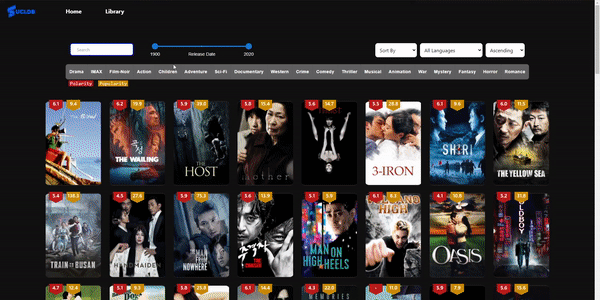

# COMP0022 - Group 4

_Note: GitHub Insights are not full accurate representations of the work distribution, as a big chunk of work was done over Visual Studio Live Share._

**Team Members: Thowhid Ahmed, Daulet Batayev, Michael Khot, Hamza Nasir.**

## Demo




## Getting Started

### Prerequisites

- `git`
- [`python3`](https://www.python.org/downloads/)
- [`docker`](https://docs.docker.com/get-docker/) & [`docker-compose`](https://docs.docker.com/compose/install/)
- [`node`](https://nodejs.org/en/download/) (& `npm`)

### Clone the Repository

```bash
git clone git@github.com:dau1et/COMP0022-Group4.git
cd COMP0022-Group4
```

### Create the Required Data

First, install the `aiohttp` package:

```bash
pip3 install aiohttp
```

Then run the script to request the movie data and create CSVs:

```bash
cd csv_data
python3 create_csv_tables.py
```

### Startup the Database, Backend, Redis, and Jaeger Services

This can be done by running a single command in the `/dev` directory:

```bash
cd ../dev
docker-compose up --build
```

> NOTE: The `.env` file is only included for demonstration purposes. Since this file contains sensitive information, it would not be included for production.

(OPTIONAL) To enable database backups, run:

```bash
./start_backups
```

### Startup the Client

Install the necessary packages for the client and run the start command:

```bash
cd ../client
npm install
npm run start
```

### Navigate to Web App

Go to http://localhost:3000 and enjoy the Movie Analytics app :)

API documentation can be accessed at http://localhost:3001/docs
Application monitoring can be accessed at http://localhost:16686
